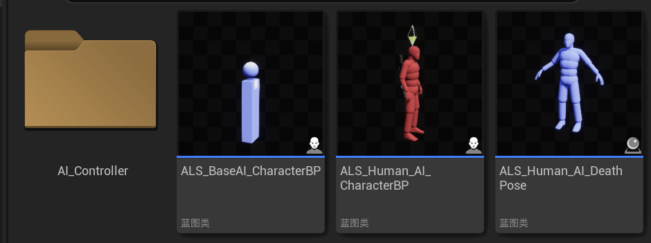
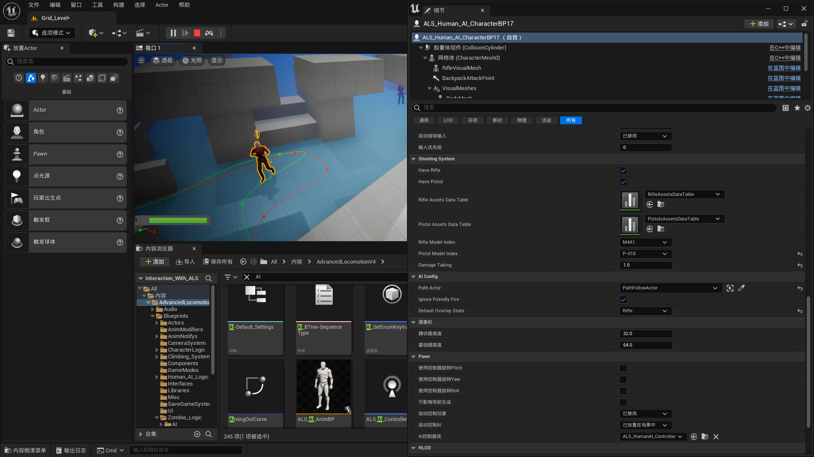
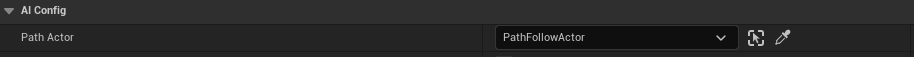
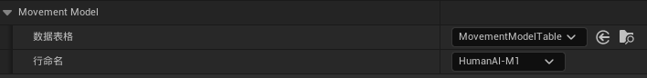
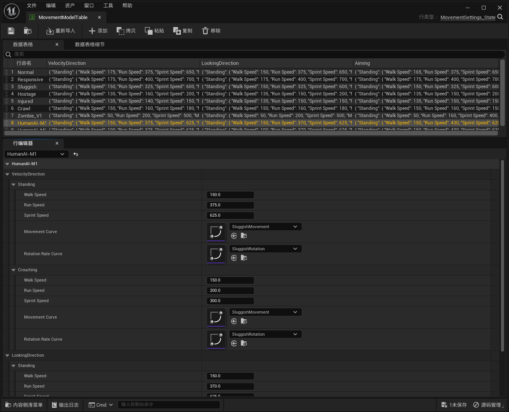
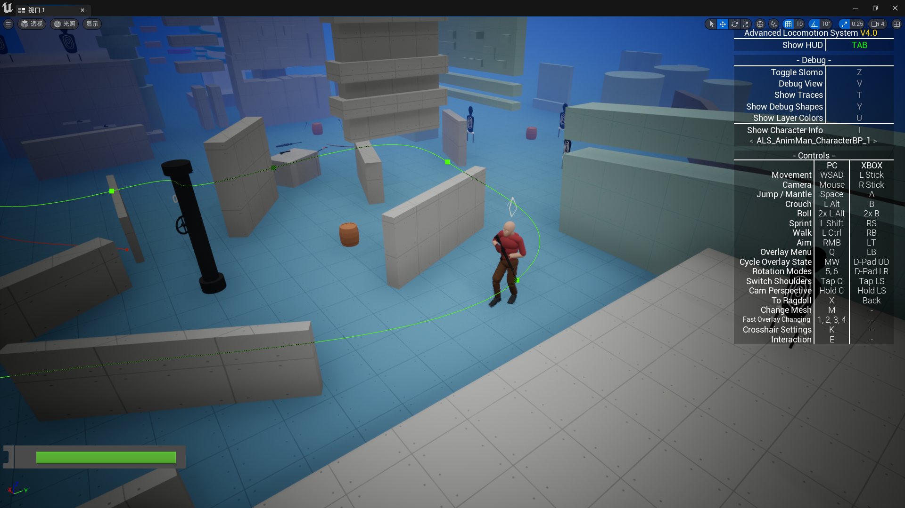
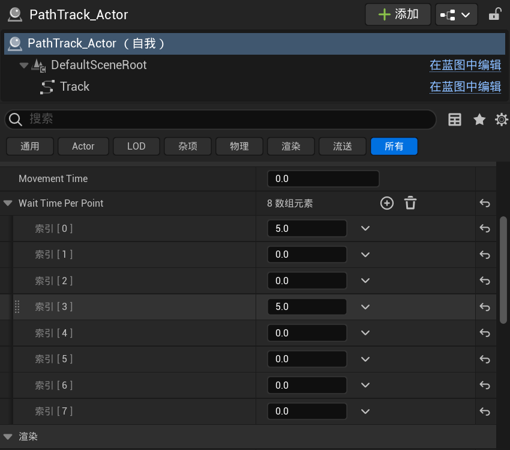

# IWALS V4_AI使用指南

## AI蓝图

敌人AI相关蓝图在文件夹“Human_AI_Logic”中：

## AI实例修改

想要修改参数，需要将上图中的AI蓝图"ALS_Human_AI_CharacterBP"拖放至关卡中，选中，并在左下方的细节面板处进行修改。如果找不到参数，直接搜索即可。

AI实例拥有大量的可调整参数，但是其中的**绝大部分是不可以调整**的。故需要调整敌人的参数时，请**只调整下面提到的参数**。

### AI背包

没什么用的参数，但是在场景中放置并指定一个"BP_Backpack_ForAI"实例，可以让敌人获得一个背包。这个背包没有阻挡子弹的作用，纯摆设。

### AI枪械

前两个参数可以控制AI是否有对应的枪，第五第六个则是对应的枪的类型。

### AI伤害

Damage Taking则是敌人受伤害的倍率。默认情况下是0.22，通过将数值改高可以使敌人更容易被击毙，改小则血量更厚。

若是希望整体调整敌人AI的受伤倍率，可以在蓝图基类里面进行修改。

敌人之间也可以互相造成伤害，通过勾选这个参数。

### AI路径

通过此参数选定场景中的PathFollowActor，可以控制AI按照此路径移动。具体在下方的**AI寻路**处会提到。

### AI移动速度

AI的移动速度不能直接进行修改，但是通过模板中给出的数据表格，我们可以使用不同的角色速度预设或创建自己的速度预设。

打开"MovementModelTable"，我们可以看到上图参数中”行命名“参数所对应的不同速度值。

上图我们可以看见敌人在不同状态下的移动速度区别。通过选定对应的行命名就可以进行修改。通过上方的”添加“也可以创建我们自己的移动速度预设。

## AI寻路

### 样条线

设置敌人AI进行寻路时，需要用到导航体积。然后需要用到一个寻路样条线的蓝图“PathTrack_Actor”：

选中样条点后摁住ALT键拖动可以添加新的样条点。选中要跟随此样条线寻路的敌人AI，并设置其“Path Actor”为刚刚创建好的样条线。设置好的样条线即为AI的行进路线。

敌人AI会从样条点0一直走到最后一个样条点，然后自动寻路回样条点0而非反向寻路。如果想要控制敌人AI在样条点停留，则可以在下图所示的参数中设置敌人AI在不同点处的等待时间。

默认情况下，无论样条线是否勾选”闭合循环“，AI在完成一次沿样条线的行走之后，都会重新寻路走回索引[0]对应的点并且重新开始寻路。

### 停止点

如果需要AI在走到一个固定的点后就直接永久停止行走，我们就需要一个叫做"AI_SittingPoint"的蓝图。将这个蓝图对应的范围放在AI移动路径上，AI就会在到达该范围后直接停止移动并坐下。

通过修改参数中的Stand Delay，可以让AI在一定时间后重新站起来，并继续沿样条线移动。如需触发此功能，该值必须大于3。同理，想让敌人坐下不站起来就必须让此值小于等于3。

通过设定参数"Only For",可以指定一个AI并只让其坐下

