# IWALS V4_AI使用指南 v2.0

## AI实例修改

想要修改参数，需要将上图中的AI蓝图"ALS_Human_AI_CharacterBP"拖放至关卡中，选中，并在左下方的细节面板处进行修改。如果找不到参数，直接搜索即可。

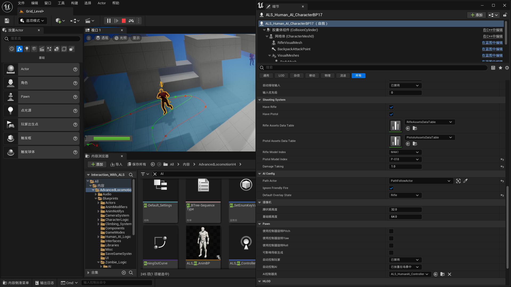

AI实例拥有大量的可调整参数，但是其中的**绝大部分是不可以调整**的。故需要调整敌人的参数时，请**只调整下面提到的参数**。

### AI背包

没什么用的参数，但是在场景中放置并指定一个"BP_Backpack_ForAI"实例，可以让敌人获得一个背包。这个背包没有阻挡子弹的作用，纯摆设。

### AI枪械

前两个参数可以控制AI是否有对应的枪，第五第六个则是对应的枪的类型。

### AI伤害

Damage Taking则是敌人受伤害的倍率。默认情况下是0.22，通过将数值改高可以使敌人更容易被击毙，改小则血量更厚。

若是希望整体调整敌人AI的受伤倍率，可以在蓝图基类里面进行修改。

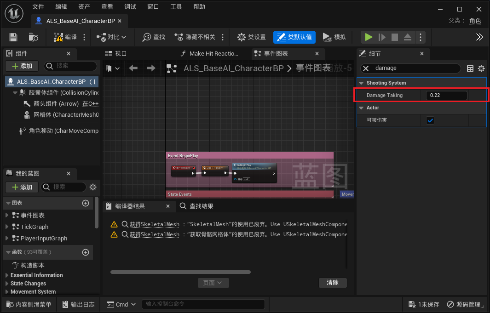

敌人之间也可以互相造成伤害，通过勾选这个参数。

### AI路径

通过此参数选定场景中的PathFollowActor，可以控制AI按照此路径移动。具体在下方的**AI寻路**处会提到。

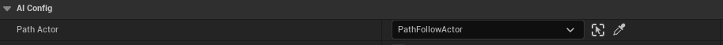

### AI移动速度

AI的移动速度不能直接进行修改，但是通过模板中给出的数据表格，我们可以使用不同的角色速度预设或创建自己的速度预设。

打开"MovementModelTable"，我们可以看到上图参数中”行命名“参数所对应的不同速度值。

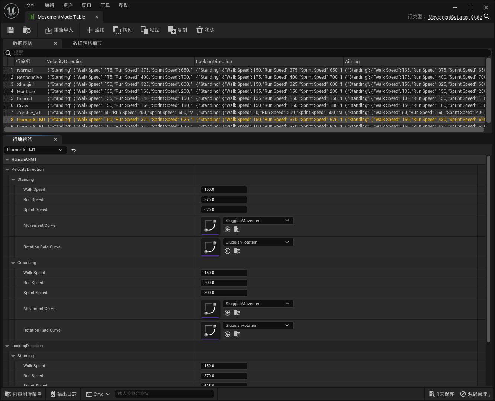

上图我们可以看见敌人在不同状态下的移动速度区别。通过选定对应的行命名就可以进行修改。通过上方的”添加“也可以创建我们自己的移动速度预设。

## AI寻路

### 样条线

设置敌人AI进行寻路时，需要用到导航体积。然后需要用到一个寻路样条线的蓝图“PathTrack_Actor”：

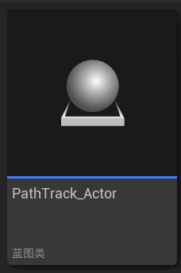

选中样条点后摁住ALT键拖动可以添加新的样条点。选中要跟随此样条线寻路的敌人AI，并设置其“Path Actor”为刚刚创建好的样条线。设置好的样条线即为AI的行进路线。

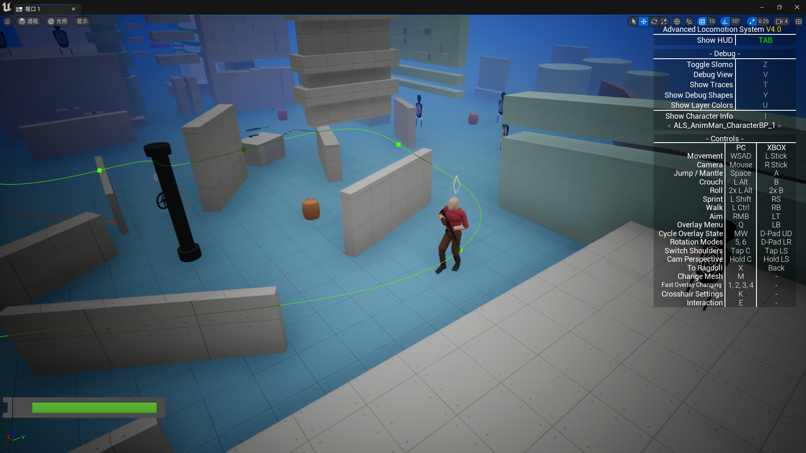

敌人AI会从样条点0一直走到最后一个样条点，然后自动寻路回样条点0而非反向寻路。如果想要控制敌人AI在样条点停留，则可以在下图所示的参数中设置敌人AI在不同点处的等待时间。

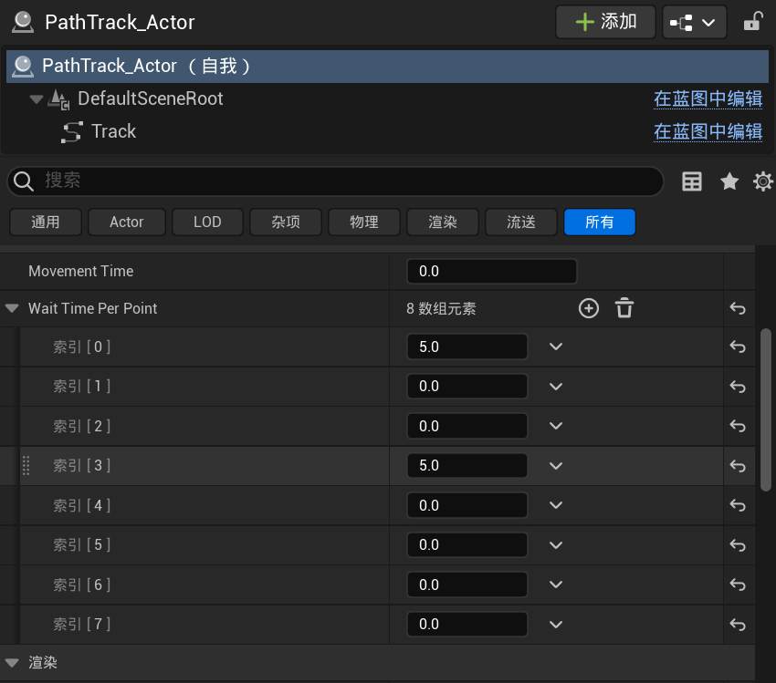

默认情况下，无论样条线是否勾选”闭合循环“，AI在完成一次沿样条线的行走之后，都会重新寻路走回索引[0]对应的点并且重新开始寻路。

### 停止点

如果需要AI在走到一个固定的点后就直接永久停止行走，我们就需要一个叫做"AI_SittingPoint"的蓝图。将这个蓝图对应的范围放在AI移动路径上，AI就会在到达该范围后直接停止移动并坐下。

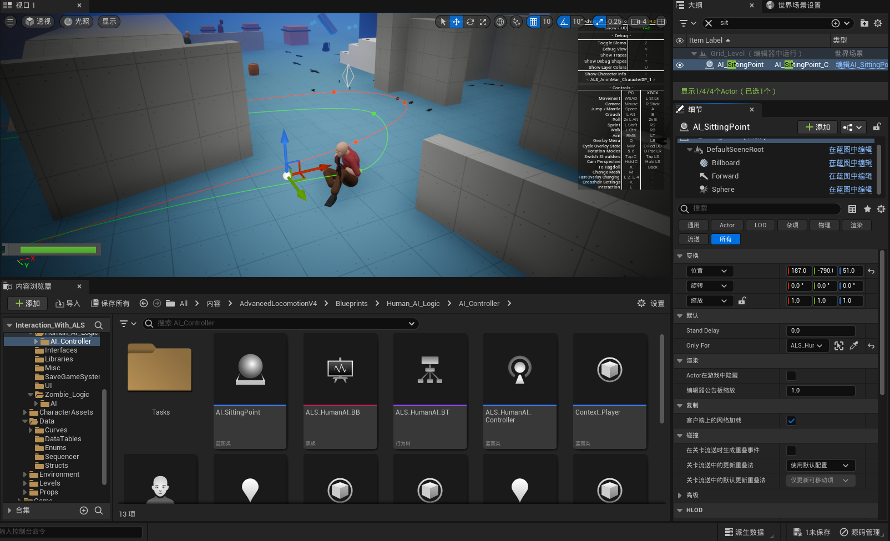

通过修改参数中的Stand Delay，可以让AI在一定时间后重新站起来，并继续沿样条线移动。如需触发此功能，该值必须大于3。同理，想让敌人坐下不站起来就必须让此值小于等于3。

通过设定参数"Only For",可以指定一个AI并只让其坐下

## AI蓝图逻辑与可修改参数或逻辑

敌人AI相关蓝图在文件夹“Human_AI_Logic”中：

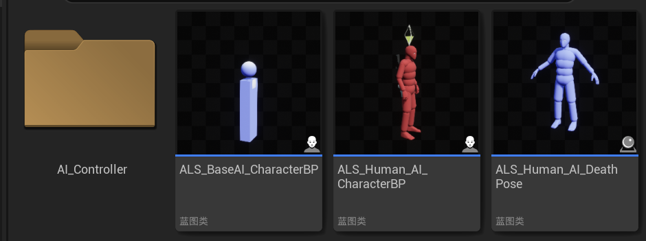

下面提到的部分内容可能为定制内容，需要先去仓库拉取更新才能看见。我默认会上传到"Code_Test"分支。如果遇见找不到该参数的情况记得先拉取。下面会将进行了修改的部分字体加粗，请留意。

### AI听觉

AI的听觉范围为**5000.0cm**具体参数写在"ALS_HumanAI_Controller"中，组件处选择听觉接收器，可以在细节处调整听觉范围。

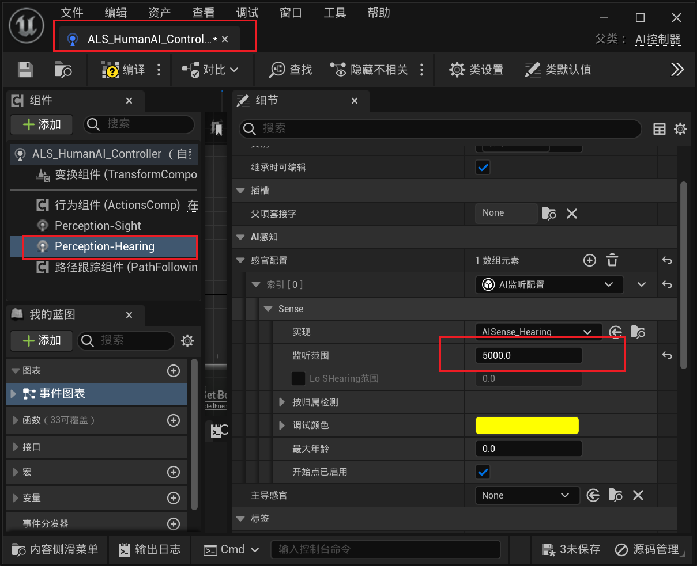

目前AI能听到的声音Tag只有两种，一种为"Scream"，一种为"Shoot"。

在听到"Scream"后，AI会望向声音出现的地方。有寻路功能的AI会朝向此地方的同时继续沿路径行走，而无寻路的AI则会前往此地方。两者都将在一段时间（还未找到该参数）后恢复到正常寻路状态。目前暂时不清楚"Scream"的噪音事件如何触发，但是可以用这个逻辑来写类似于丢玻璃瓶的功能

而在听到"Shoot"后，则会直接进入战斗模式，并且快速前往声音出现的位置寻找玩家。并且在10—20s内恢复到正常巡逻状态。此参数可调整。(V2.0已将此参数调为150-200以增加难度)在"Human_AI_HearSequeceV2"蓝图中找到如下所示节点。此节点代表恢复到正常巡逻状态的时间。

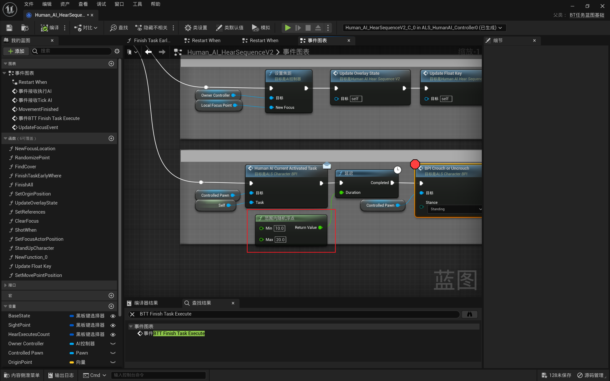

关于枪声的范围与大小，具体可以在下图所示的蓝图中进行调整（V2.0已将消音手枪声音范围修改为80）：

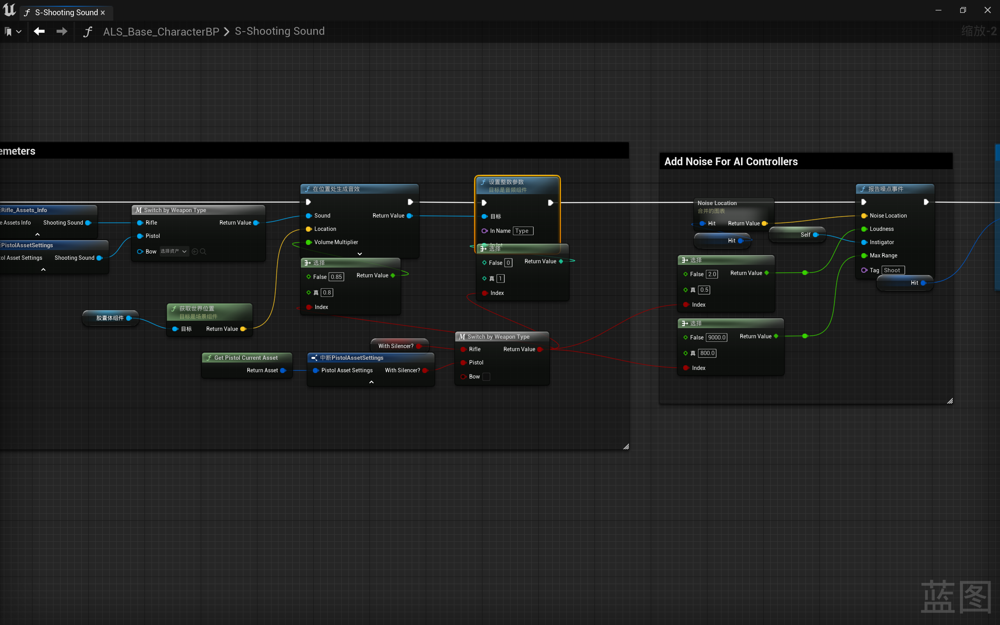

这里我将装备消音器后的声音距离改为了80，符合潜行玩法需要。具体可以按需求修改。

V2.0经过**逻辑修改**，已经使敌人可以听到了脚步声。在下图所示处可以修改玩家角色脚步声范围和大小：

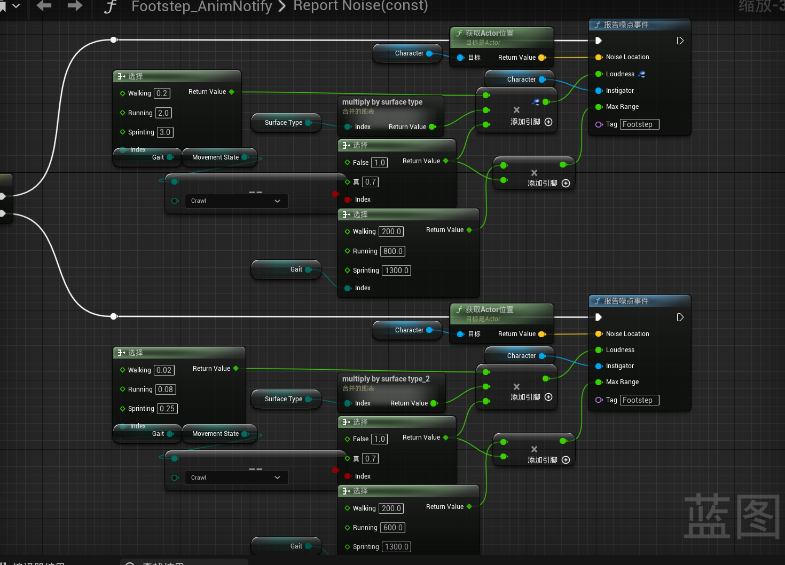

敌人对脚步声的敏感程度（每次听到脚步声增加的警戒值倍率）可以通过参数"FootStepSensitivity"来进行调整。经过测试，值范围处于0-3之间较为合理。我个人倾向于将该值设定为1：

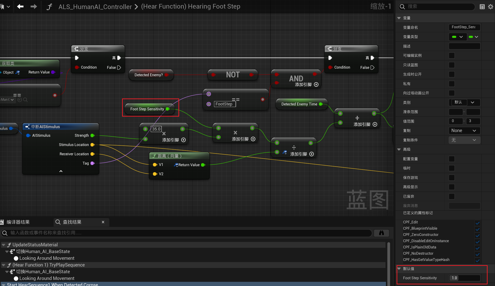

#### 逻辑修改

##### 脚步声

AI听不见脚步声。通过以下修改方式使AI能够听见脚步声

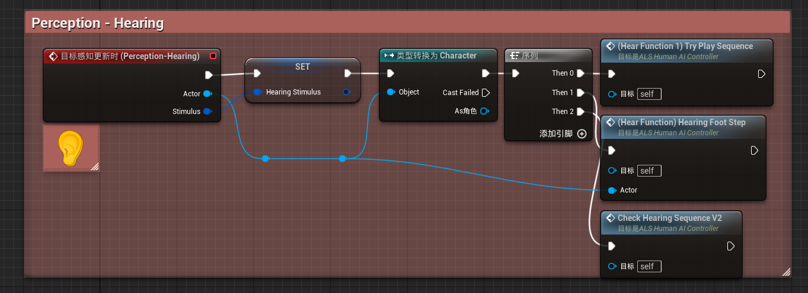

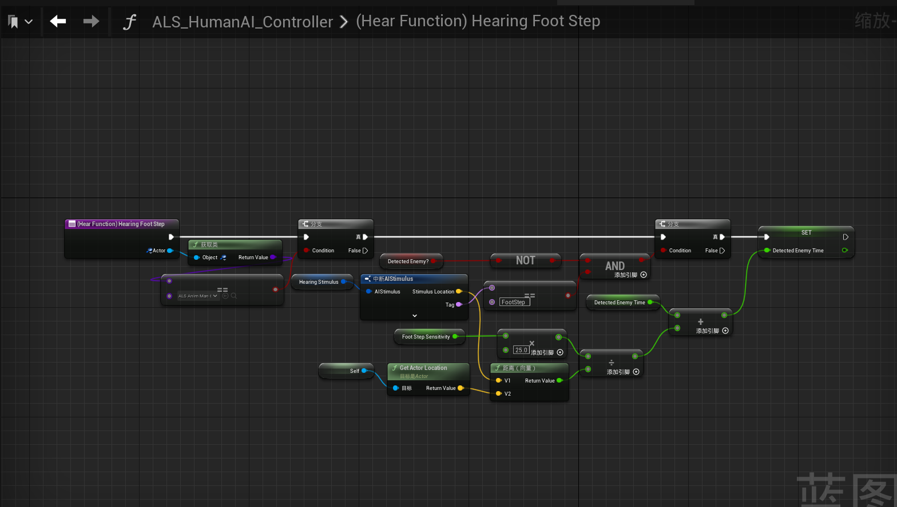

##### 尖叫声

由于敌人收到手枪攻击时其他敌人无反应，故使其尖叫并引起敌人注意力，进入搜寻敌人的模式。此处逻辑修改较为复杂，我将图表折叠了，请到下图所示查看。

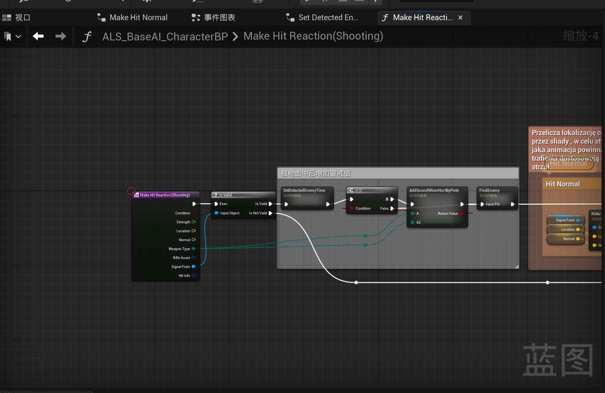